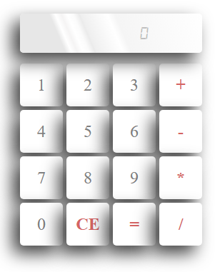

# About Calki

This calculator is made with HTML, CSS and Javascript. Sometimes we need to calculate a lot of stuffs, but no worries, we have an awesome calculator here which is same like those other calculators that you can find anywhere on the planet more easily accessible than the one that we provide. But then also we want you to try this calculator out and do some serious math with it as hard as you can. You may not score good marks in math but you can really get used to the pain in your fingers while using **calki**. Enjoy the pain 😂

# Base version

Get the base version of this app [here](https://github.com/hiddartho/Calculator)
